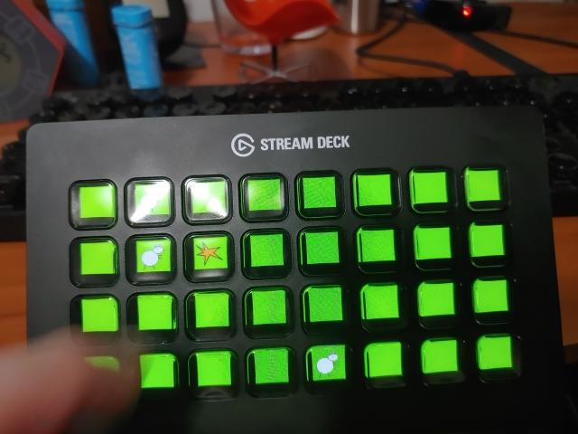

# Whack-a-mole game for Elgato Stream Deck
Author: Jack Mudge <jack@mudge.dev>

# Dependencies
1. pip install streamdeck pillow
2. Follow the streamdeck library installation instructions, particularly
   for USB backend permissions. See:
    https://python-elgato-streamdeck.readthedocs.io/en/latest/pages/backend_libusb.html
3. Obviously, you will need a StreamDeck. This game assumes the first attached StreamDeck is playable.
   The streamdeck must be a StreamDeck XL for the start and end screens to render. This is considered
   a bug and should be fixed in future versions, so the game can be played (in some capacity) on 
   cheaper devices.

# Instructions

Clone the repository, install the dependencies as listed above, then run:

`python3 whackastreamdeck.py`

The game will ask you to press a key to start, and run for one minute. At the end of one minute, your score is the number of moles you successfully whacked. After the game, press 'X' (in the upper-right corner) to exit, after which high scores are printed to stdout.

# 3rd Party Licenses

Unless otherwise stated below, all contents Copyright (C) Jack Mudge and released under MIT terms, see LICENSE.

Font "ViaFont" (Assets/ViaFont.zip and .ttf) 
    Source: http://www.publicdomainfiles.com/show_file.php?id=13949894425072
    License: Public Domain

Deck.py:
    Steals heavily from StreamDeck library examples.
    Source: https://github.com/abcminiuser/python-elgato-streamdeck
    License: MIT

# Revision History

2020-05-13 - Initial release.
